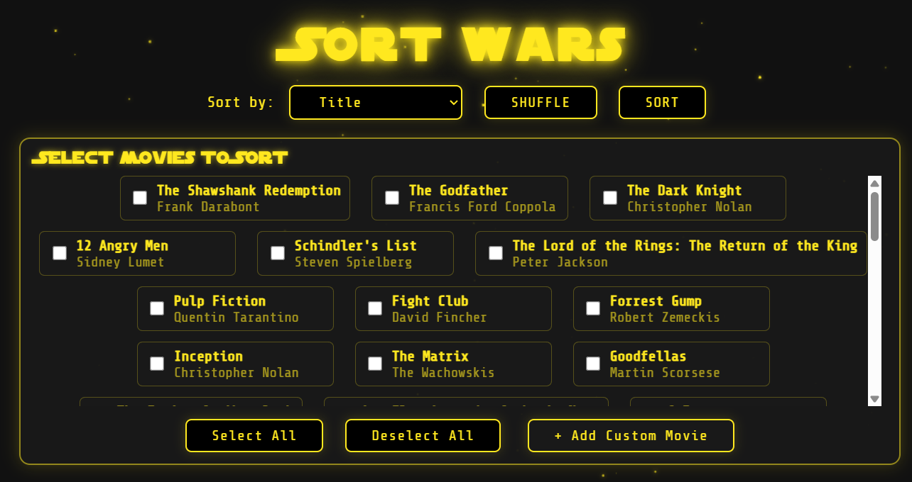
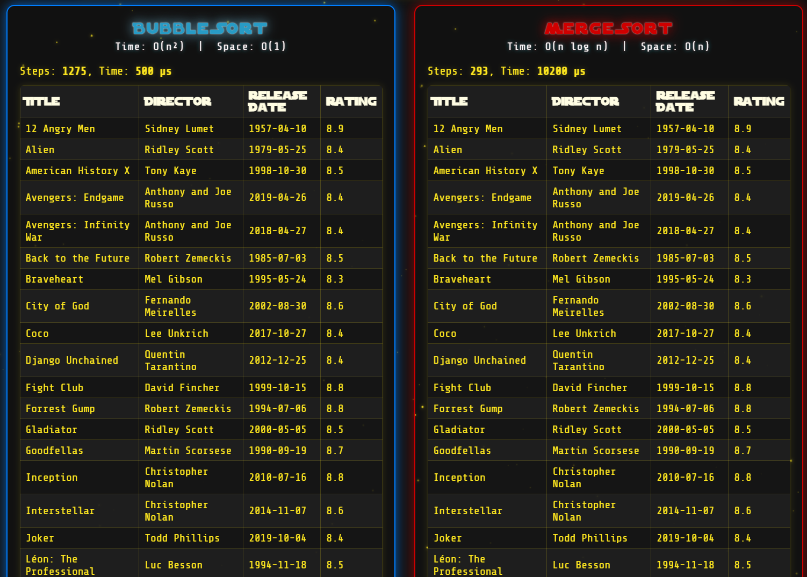

# Sort-Wars

Welcome to **Sort-Wars**!  
This interactive app lets you visualize and compare how two classic sorting algorithms—**Bubble Sort** and **Merge Sort**—work by sorting a list of movies.

## 🚀 Features

- **Visualize Sorting**: Watch Bubble Sort and Merge Sort in action.
- **Sort by Multiple Criteria**: Organize the movie list by:
  - Title
  - Director
  - Rating
  - Duration
  - Release Date
- **Step-by-Step Animation**: See how each algorithm arranges the movies, step by step.
- **Compare Performance**: Understand the differences in speed and behavior between the two algorithms.

## 📸 Screenshots

## 🧑‍💻 How It Works

- **Bubble Sort**: Repeatedly steps through the list, compares adjacent items, and swaps them if they’re in the wrong order.
- **Merge Sort**: Recursively splits the list in half, sorts each half, and then merges them back together.

You can select the sorting algorithm and the property to sort by from the app’s interface. The visualization will update in real time, helping you understand each algorithm’s process.

## 🤝 Contributing

Contributions are welcome!  
Feel free to open issues or submit pull requests to improve the app.

-------

Enjoy learning about sorting algorithms with **Sort-Wars**!
